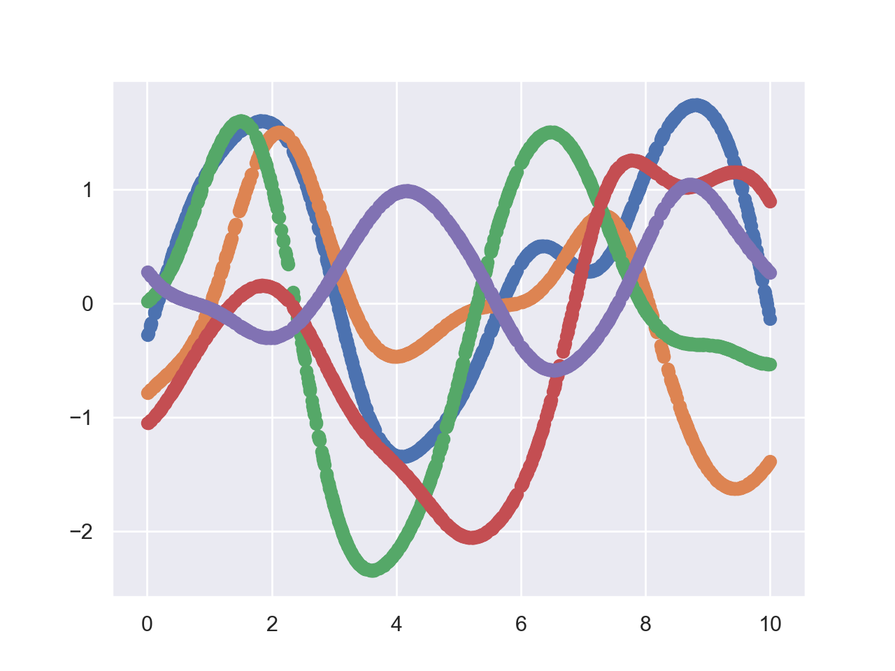
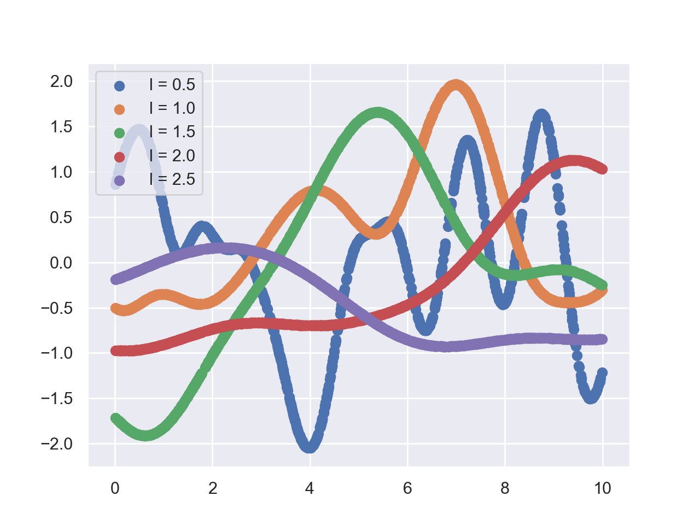
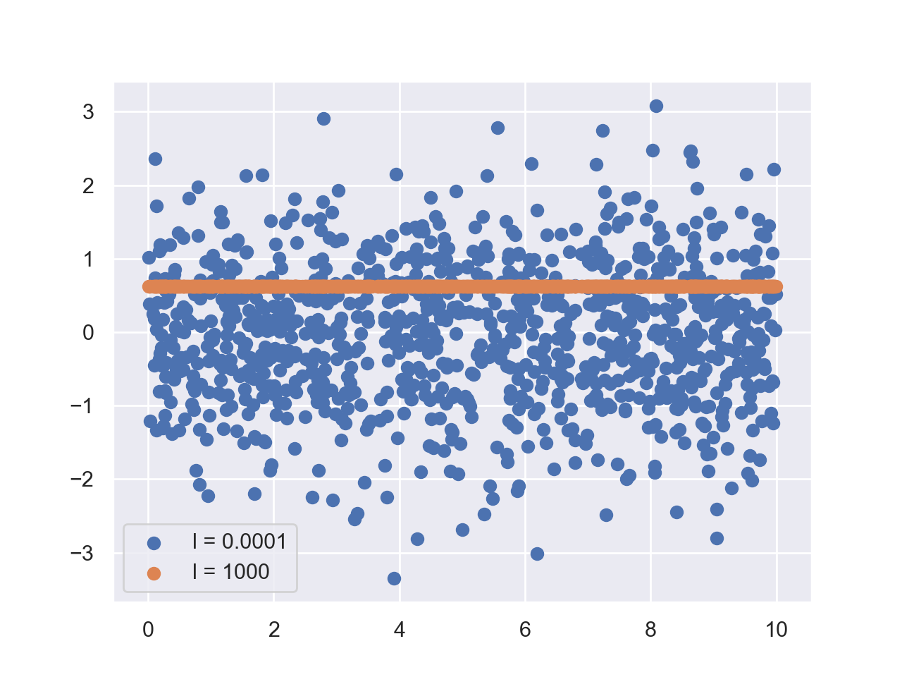

* ToC
{:toc}

To test our theoretical derivation, we present a short python script. The full script can by found in the notebook [here](https://github.com/BLyndon/bayesian_methods/blob/master/notebooks/gp_sampling.ipynb). 

First of all, we need to fix the kernel $$k$$

$$
    k(x_i, x_j) = \exp \left( - \frac{|x_i - x_j|}{2 l^2} \right)
$$

The parameter $$l$$ is the correlation length. Now we can start with python

~~~ python
def kernel(d, l=1):
    return np.exp(-d**2 / (2 * l**2 ))
~~~

The method `distance_matrix` is included from `scipy.spatial`

~~~ python
def covariance(x, l=1):
    x = np.reshape(x, [-1, 1])
    d = distance_matrix(x, x)
    return kernel(d, l)
~~~

We uniformly sample $$n=1000$$ positons $$x_i$$ in the interval $$(0, 10)$$ and create the distribution over $$y_i$$ with mean zero and $$l = 1$$

~~~ python
n = 1000
x = 10*np.random.rand(n)

l = 1
mean = np.zeros(n)
cov = covariance(x, l)
~~~

Then we draw 5 samples from this distribution and plot them in a single diagram

~~~ python
for i in range(5):
    y = np.random.multivariate_normal(mean=mean, cov=cov)
    plt.scatter(x, y)

plt.show()
~~~

|                                           |
| :-----------------------------------------------------------------------------------------------: |
| Five samples drawn from the distribution with $$l=1$$ with positions ranging from $$0$$ to $$10$$ |

Now we vary the correlation length from $$l=0.5$$ to $$l=2.5$$ and draw samples from the corresponding distribution.

|                           |
| :--------------------------------------------------------------------------------: |
| Five samples drawn from the distribution with increasing correlation length $$l$$. |

Finally we examine the limits $$l \to 0$$ and $$l \to \infty$$.

|                                        |
| :-----------------------------------------------------------------------------------------------: |
| Samples drawn in the limit of infinity correlation length and vanishing correlation length $$l$$. |