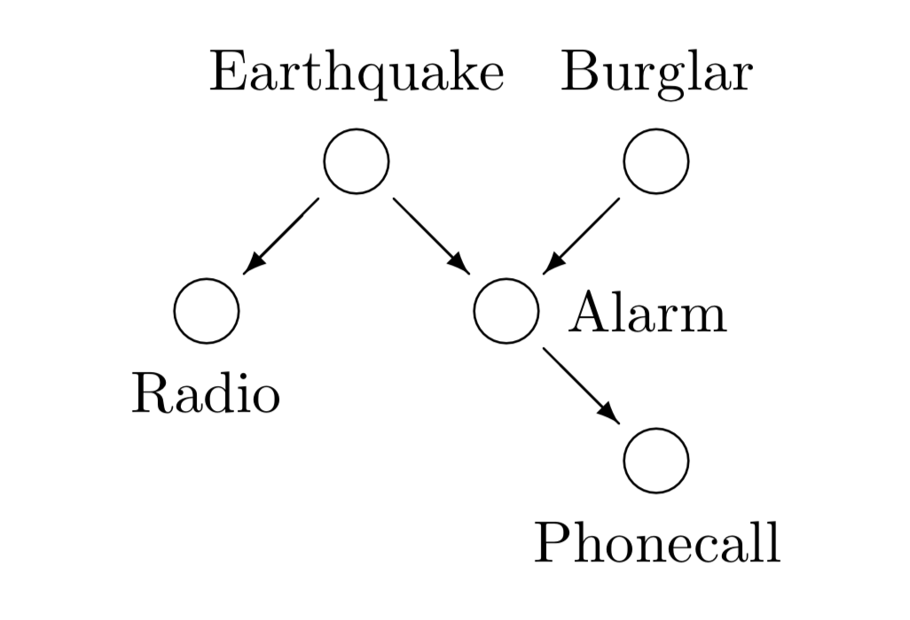

* ToC
{:toc}

---

We start our discussion on inference with an example given in Mackay (2003) - the burglar alarm. The problem serves well for introducing the fundamental concepts of inference, since we are dealing with binary random variables in a simple probabilistic network. Thus it is possible to solve the problem exactly and directly apply the most important rules to simple expressions.

---

## Exact Inference: The Burglar Alarm

>Fred lives in Los Angeles and commutes 60 miles to work. Whilst at work, he receives a phone-call from his neighbour saying that Fred’s burglar alarm is ringing. What is the probability that there was a burglar in his house today? While driving home to investigate, Fred hears on the radio that there was a small earthquake that day near his home. ‘Oh’, he says, feeling relieved, ‘it was probably the earthquake that set off the alarm’. What is the probability that there was a burglar in his house? (After Pearl, 1988).

Intuitively we assume that our example is described by the following Belief Network.

|  |
| :------------------------------------------------------------------: |
|     Belief network for the burglar alarm problem. (Mackay (2003)     |

Given the belief network, the joint probability factorizes by multiple application of the chain rule

$$
    P(b, e, r, a, p) = P(b)P(e)P(a|b,e)P(p|a)P(r |e)
$$

where we have introduced the following variables
- burglar *b*
- earthquake *e*
- radio *r*
- alarm *a*
- phonecall *p*

Now, with help of prior knowledge, we can estimate the probabilities and list them in a table.

*Prior distributions*

| $$P(x)$$| $$x = b$$ | $$x = e$$ |
| ------------- |:-------------:| -----:|
| $$x = 0$$ | $$1 - \beta$$ | $$1 - \epsilon$$ |
| $$x = 1$$ | $$\beta$$ | $$\epsilon$$ |

We assume a small probability $$f$$ of a false alarm caused by some other event. The $$\alpha_b$$ denotes the reliability of the alarm in case of a burglary and the earthquake triggers the alarm with a probability of $$\alpha_e$$.

*Likelihood function*

| $$P(a=0;b,e)$$ | $$b = 0$$ | $$b = 1$$ |
| ------------- |:-------------:| -----:|
| $$e = 0$$ | $$(1 − f)$$ | $$(1−f)(1−α_b)$$ |
| $$e = 1$$ | $$(1−f)(1−α_e)$$ | $$(1−f)(1−α_b)(1−α_e)$$ |

Further it seems plausible to assume

$$
    P(p=1|a=0)=0, \quad P(r=1|e=0)=0
$$

This implies, in particular, that we have certainty for $$a=1$$, $$e=1$$, if we observe $$p=1$$, $$r=1$$ respectively.

Now we can formulate the inference task: 

>Receiving a phone call ($$p=1$$), what can we say about the probability of a burglar and an earthquake, i.e. P(b,e;p=1)

For $$p=1$$ we have certainty for $a=1$, then with *Bayes' Theorem* we arrive at

$$
    P(b, e|a=1) = \frac{P(a=1|b, e)P(b)P(e)}{P(a=1)}
$$

The expressions in the numerator, we can read off from the tables above. The unknown marginal probability $$P(a=1)$$ on the other hand is fixed by the normalization constraint.

The probability for a burglar after a phonecall is given by the marginalization over the earthquake variable $$e$$

$$
    P(b|a=1) = \sum_{e={0,1}} P(b,e|a=1)
$$

The probability of an earthquake on the other hand, is given by marginalization over the burglar $$b$$ variable

$$
    P(e=1|p=1) =  \sum_{b={0,1}}\frac{P(a=1|b, e=1)P(b)P(e=1)}{P(a=1)}
$$

#### Conclusion
The only accessible variables to Fred at work were the phonecall $$p$$ and the radio $$r$$. But knowing the circumstances summarized in the **belief network** and the probabilities we were able to infer the probability of a burglar or an earthquake.

In case of few and discrete variables, we are able to completely enumerate all hypotheses and evaluate their probabilities. In continuous hypothesis spaces however, this is no longer feasible. 

E.g. for a two component Gaussian mixture model

$$
    P(x| \mu_1, \sigma_1, \pi_1, \mu_2, \sigma_2, \pi_2) = \pi_1 \mathcal N (x| \mu_1, \sigma_1) + \pi_1 \mathcal N (x| \mu_2, \sigma_2)
$$

we have 5 independent continuous parameters. As before we could by discretize the space as is needed for working with a computer and again completely enumerate and evaluate.

To reduce the uncertainty of $$K$$ parameters, we need to grid each dimension. In other words, the cost for grid increases **exponentially** with the dimension of the parameter space. Consequently we need a different approach, which we will discuss below.

## Maximum Likelihood Estimation

Instead of enumerating all hypotheses, we will search for a single hypothesis from the hypothesis space $$\mathcal H$$ that fits the observations well. The hypotheses in $$\mathcal H$$ are parametrized by $$\theta$$. Now, the idea is to learn the value of $$\theta$$, such that the probability observing the data $$X$$ from the hypothesis distribution is maximized. This is summarized under the term **maximum likelihood estimation** (MLE), as we are maximizing the **likelihood** function. For convenience we will maximize the **loglikelihood** instead

$$
    \underset{\theta}\text{argmax} \log P(X | \theta, \mathcal H)
$$

The concept of maximum likelihood exists in the frequentist as well as in the Bayesian paradigm. While the frequentists assume a single parameter $$\theta$$ fixed by the real data distribution, the bayesians observe a single fixed dataset $$\mathcal D$$ an infer an uncertainty for the parameter $$\theta$$.

## Maximum A-Posteriori

Instead of learning $$\theta$$ by maximizing the loglikelihood, we can maximize the posterior probability density. 

For fixed observed data $$\mathcal D$$, the posterior distribution is given by Bayes' rule

$$
    P(\theta | X) = \frac{P(X | \theta) P(\theta)}{P(X)}
$$

Then the the value for $\theta$ is given by

$$
    \theta_{MAP} = \underset{\theta}\text{argmax} P(\theta | X)
$$ 

which is called the **Maximum A Postiori** estimation.

Another choice is given by the expectation of $\theta$

$$
    \langle \theta \rangle = \int \theta P(\theta| X) d \theta
$$

which is called **Bayes estimate** 

## Regularization

The prior distribution introduces regularization in a natural way. Adding regularization to the cost function constrains the magnitude of the parameters. The same can be achieved by a the prior $$p(\theta)$$ in a bayesian model, forcing smaller magnitudes by a higher probability around the origin.

As an example, we consider a prior distribution $$p(\theta) = \mathcal N(\theta; 0, I/\lambda)$$, leading to the followingt logposterior

$$
    \log p(\theta|X) = \log \frac{p(X|\theta)p(\theta)}{p(X)} = \log p(X|\theta) - \frac{\lambda}{2} \sum_i \theta_i^2 + const.
$$

Thus, this particular choice of the prior leads to a $$L^2$$ regularization.