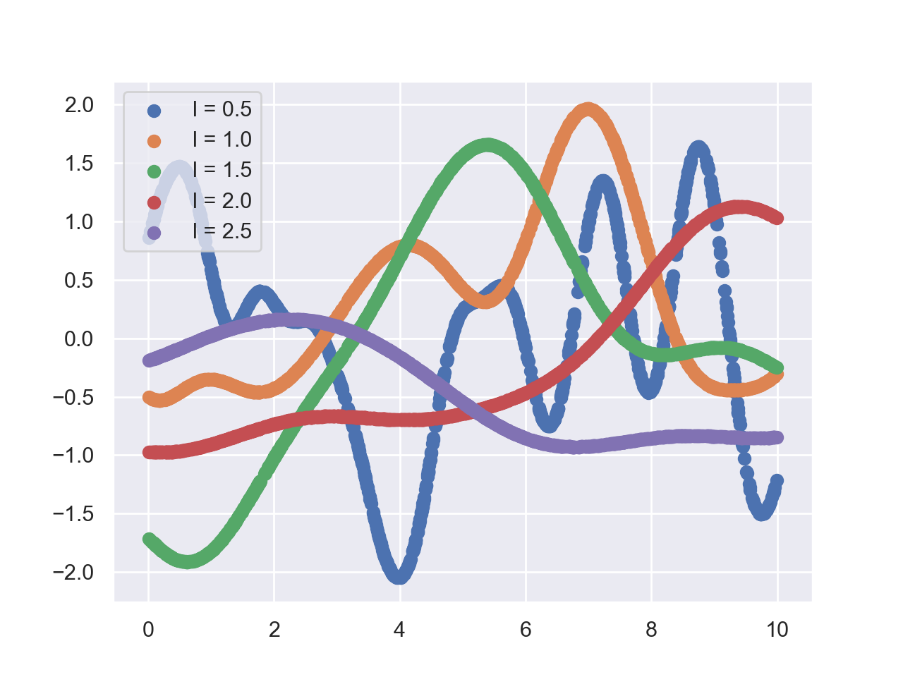

* ToC
{:toc}

When hiking in the mountains not only the distance covered is interesting but also the altitude. The altitude along the track then is a 1-dimensional continuous function of the distance.

To create a height profile of the track the altitude may be measured at certain points along the path. The amount of data points of course is restricted to a finite number, although the true altitude function is defined everywhere.

After collecting the data, we want to construct the true function from the finite set of data points. Instead of fixing a parametric model function, we want to follow a different approach: To construct the function we want to derive a probability distribution over functions.

## Gaussian Processes

To derive a probability distribution over functions, we need to introduce a probability distribution for each outcome along the path. The finite set of measurements $$A(x_i)$$ can be used to infer the probability of the functional outcome for every possible value $$x$$ in continuous set of positions along the countinuous path.

$$
p(A(x)|A(x_1), \dots, A(x_k))
$$

But first, let's think about the joint probability of the measurements. The values $$A(x_i)$$ for each $$x_i$$ are a scalars, so we could try to model each of these values by a one dimensional gaussian random variable resulting in a fully factorized joint distribution. 

Compared to climbing, hiking trails vary smoothly along the path, so the values of the random variables will depend on each other. This imposes a correlation between the points at different positions. While close points are strongly correlated, points far from each other are almost uncorrelated.

The factorized joint distribution, which is essentially a diagonal multivariate gaussian, is not able to model these correlations. Correlations between different measured values $$A(x_i)$$ are given by finite off-diagonal entries in the covariance. 

By replacing the diagonal by a non-diagonal covariance matrix, the multivariate gaussian distribution captures both observed qualitative features of our system.

**Gaussian Process** The probability distribution of a function $$y(x)$$ is a Gaussian process if for any finite selection of points $$x_1,\dots,x_k$$, the density $$p(y(x_1),\dots,y(x_k))$$ is Gaussian.

Being a multivariate gaussian, the joint distribution over the k variables $$A(x_1), \dots, A(x_k)$$ is fully specified by the mean and the covariance. The mean and the covariance depend neccesarily on the finite selection of points $$x_1,\dots,x_k$$. Otherwise the outcome would be sampled from the same distribution for all positions and the model wouldn't be able to sample non-constant functions.

The mean is set to be zero for symmetry reasons, since we lack prior knowledge. Additionally, the correlations given by real numbers are symmetric. The elements of the covariance matrix for all possible positional pairings will be modeled by a suitable kernel function $$k$$ decaying with the distance between two points

$$
cov(A_i, A_j) = k(x_i, x_j) = k(||x_i - x_j||) = \Sigma_{ij}
$$

A sample drawn from this Gaussian is a vector of $$k$$ elements corresponding to the vector of $$k$$ positions $$x_i$$. The ordering of these elements are fixed by the ordering of the covariance matrix elements, which in turn are determined by the ordering of the positional measurements. While the positional values follow no specific ordering, the ith element of the sample is paired with the ith element of the positional vector.

Remember, we aimed for a probability distribution over functions in the first place. Lets check with few lines of code wether the sample resembles a function already.

---

## Sampling from a distribution over functions

To test our theoretical derivation, we present a short python script. The full script can by found in the notebook [here](https://github.com/BLyndon/bayesian_methods/blob/master/notebooks/gp_sampling.ipynb). 

First of all, we need to fix the kernel $$k$$

$$
    k(x_i, x_j) = \exp \left( - \frac{|x_i - x_j|}{2 l^2} \right)
$$

The parameter $$l$$ is the correlation length. Now we can start with python

~~~ python
def kernel(d, l=1):
    return np.exp(-d**2 / (2 * l**2 ))
~~~

The method `distance_matrix` is included from `scipy.spatial`

~~~ python
def covariance(x, l=1):
    x = np.reshape(x, [-1, 1])
    d = distance_matrix(x, x)
    return kernel(d, l)
~~~

We uniformly sample $$n=1000$$ positons $$x_i$$ in the interval $$(0, 10)$$ and create the distribution over $$y_i$$ with mean zero and $$l = 1$$

~~~ python
n = 1000
x = 10*np.random.rand(n)

l = 1
mean = np.zeros(n)
cov = covariance(x, l)
~~~

Then we draw 5 samples from this distribution and plot them in a single diagram

~~~ python
for i in range(5):
    y = np.random.multivariate_normal(mean=mean, cov=cov)
    plt.scatter(x, y)

plt.show()
~~~

|                                           |
| :-----------------------------------------------------------------------------------------------: |
| Five samples drawn from the distribution with $$l=1$$ with positions ranging from $$0$$ to $$10$$ |

Now we vary the correlation length from $$l=0.5$$ to $$l=2.5$$ and draw samples from the corresponding distribution.

|                           |
| :--------------------------------------------------------------------------------: |
| Five samples drawn from the distribution with increasing correlation length $$l$$. |

Finally we examine the limits $$l \to 0$$ and $$l \to \infty$$.

|                                        |
| :-----------------------------------------------------------------------------------------------: |
| Samples drawn in the limit of infinity correlation length and vanishing correlation length $$l$$. |

---

## Application: Regression

To apply Gaussian processes to real world regression problems, we need to take into account the noise on our measurements. The measurement, or target value, $$t$$ then is given by the real function $$y$$ and an additive noise

$$
    t_n = y_n + \epsilon_n
$$

We expect the noise to be gaussian distributed and independent for each data point, such that

$$
    p(T | Y) = \prod_n p(t_n | y_n) = \prod_n \mathcal N (t_n; y_n, \beta^{-1}) = \mathcal N (T; Y, \beta^{-1} I_N)
$$

where $$\beta$$ is the precision of the additive noise. 

By definition the marginal distribution $$p(Y)$$ is given by a Gaussian $$\mathcal N (Y; 0, K)$$. So by integrating over $$Y$$ we find the marginal distribution

$$
    p(T) = \int p(T|Y)p(Y)dY = \mathcal N (T; 0, K + \beta^{-1}I_N)
$$

where we set $$C$$

$$
    C = K + \beta^{-1}I_N
$$

### Conditional Distribution

Given $$N$$ data points $$T$$, we now ask for a new data point $$t_{N+1}$$. In order to find the conditional distribution $$p(t_{N+1}\|T)$$, we start from the joint distribution

$$
    p(T_{N+1}) = \mathcal N (T_{N+1}; 0, \tilde C)
$$

where

$$\begin{pmatrix} C & \vec k \\ \vec k^T & c \end{pmatrix}$$

and the elements of $$\vec k$$ are given by $$k(t_n, t_{N+1})$$ and $$c = k(t_{N+1},t_{N+1}) + \beta^{-1}$$.

Using the chain rule we find

$$
    p(t_{N+1} | T) = \frac{p(T_{N+1})}{p(T)} = \frac{\mathcal N (T_{N+1}; 0, \tilde C)}{\mathcal N (T; 0, C)}
$$

$$
\begin{aligned}
    m(t_{N+1}) = \vec k^T C^{-1} T \\
    \sigma(t_{N+1}) = c - \vec k^T C^{-1} \vec k
\end{aligned}
$$

### Modelparameter optimization

The kernel function $$k$$ may introduce hyperparameters to the model, such as a the correlation length and the noise distribution introduces the precision $$\beta$$. Given the observed data, we want to optimize the hyperparameters to improve the accuracy of the predictions, by maximizing the loglikelihood $$p(T \| \theta)$$

$$
    p(T | \theta) = - \frac{1}{2} \log \det C - \frac{1}{2}T^T C^{-1} T - \frac{N}{2} \log 2 \pi
$$

---

## Bayesian Optimization

In some cases the evaluation of the function $$f$$ we want to optimize, is really expensive. A prominent example is the scoring of a machine learning model that depends on many hyperparameters. In such cases, we want to optimize the function $$f$$ with a minimum of trials.

In black-box optimization, an easy to evaluate surrogate model $$\hat f \approx f$$ is introduced. The surrogate model should be able to model arbitrary complex functions and estimate uncertainty. This is fullfilled by a non-parametric Gaussian process.

Further, we introduce an acquisition function $$\mu(x)$$. Using the surrogate model, the aquisition function guides the sampling for a new point.

**Aquisition function** 
+ Explore regions with high uncertainty
+ Exploit regions with good estimated values

There are severeal choices for an aquisition function. For example the maximum probability of improvement (MPI), the upper confidence bound (UCB), or the expected improvement (EI).

### Algorithm

> Start with few points
>
> 1. Train Gaussian process
> 2. Maximize $$\mu(x)$$ with gradient descent
> 3. Evaluate function $$f$$ at maximum of $$\mu(x)$$
> 4. Update points
>
> Repeat until convergence.

### Pros Cons

+ see Goodfellow